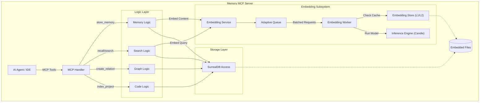
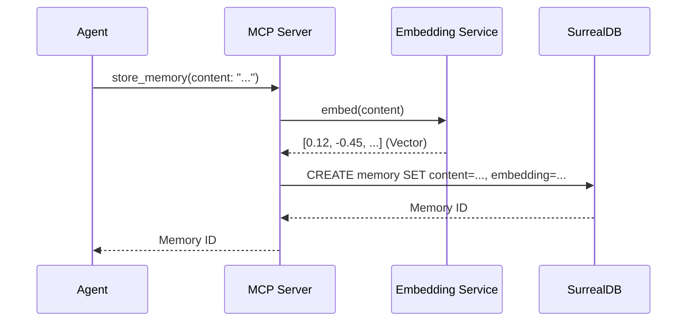
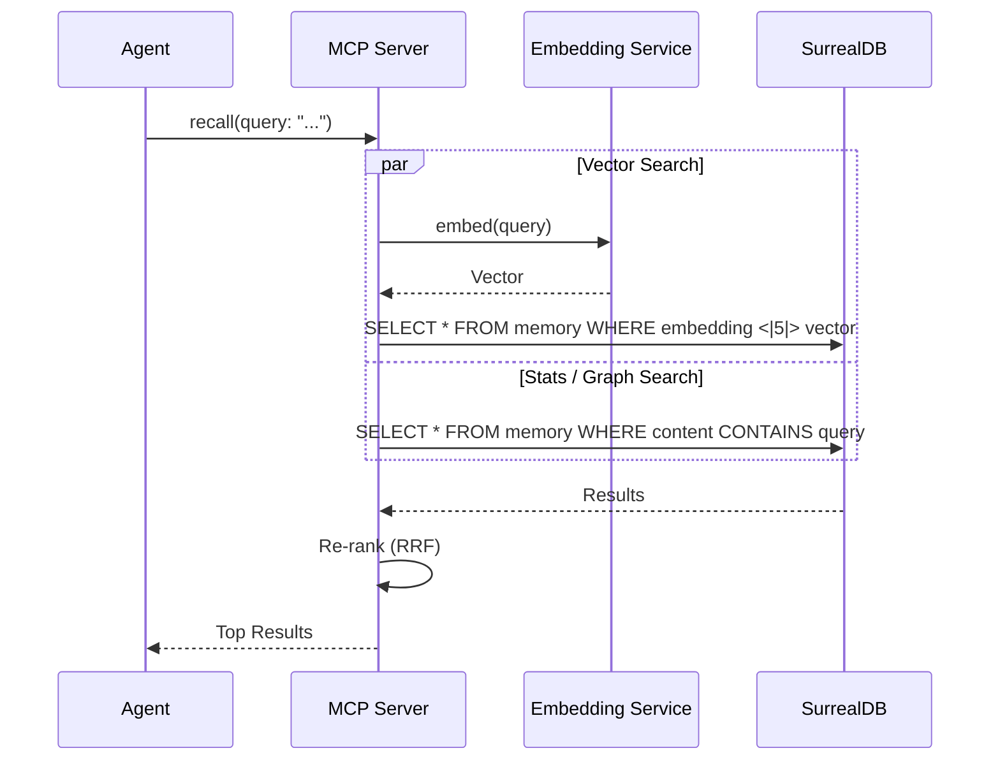

# Memory MCP Server Architecture

## High-Level Overview
Memory MCP Server is an autonomous memory system for AI agents, written in Rust. It combines semantic search (vectors), knowledge graph, and code indexing into a single binary without external dependencies.

### Key Components
1. **MCP Server**: Handles requests from clients (IDE, Agents).
2. **Embedding Architecture**: Generates vectors locally using `candle` / `ort`.
3. **Storage Layer**: Embedded SurrealDB for storing vectors, graphs, and metadata.
4. **Codebase Engine**: Indexes code using Tree-sitter (in development).

## Component Diagram (C4 Container)

## Component Details & Algorithms

### 1. Logic Layer
Responsible for request handling, routing, and business logic implementation.

*   **Reciprocal Rank Fusion (RRF)**: Algorithm for merging search results from different sources (Vector Search, BM25, Knowledge Graph).
    *   *Why*: Vector search is good for semantics ("meaning"), BM25 for exact keyword matches, and Graph for relationships. RRF allows taking the best of all three worlds without complex weight tuning.
    *   *Formula*: `score = 1.0 / (k + rank)`
*   **BM25**: Text search algorithm (Okapi BM25). Implemented on top of SurrealDB indexes.

### 2. Embedding Subsystem
Critical component for semantic search. Operates autonomously.

*   **Adaptive Queue**: Smart queue regulating vectorization request rate (Backpressure).
    *   *Algorithm*: Monitors queue depth and slows down new requests (`THROTTLE_DELAY_MS`) if the queue is filled > 80% (`HIGH_WATERMARK`).
    *   *Why*: Prevents OOM (Out of Memory) during massive file indexing.
*   **Inference Engine (Candle)**: Uses the `candle` library (Huggingface) to run BERT-like models (nomic-embed, e5) on CPU. Does not require Python.
*   **L1/L2 Cache**:
    *   L1: LRU Cache in RAM for most frequent requests.
    *   L2: Disk cache (Sled/SurrealDB) to avoid re-vectorizing unchanged content.

### 3. Graph Algorithms
Used for analyzing relationships between entities (files, functions, notes).

*   **Personalized PageRank (PPR)**: Algorithm for ranking graph nodes relative to "seed" nodes.
    *   *Application*: When a user searches for "Authorization", we find the "Authorization" node, and PPR finds all related concepts (e.g., "Login", "JWT", "OAuth"), even if the text doesn't contain the word "Authorization".
    *   *Hub Dampening*: Modification to reduce the weight of "super-nodes" (linked to everything) to avoid noise.
*   **Leiden Algorithm**: Community Detection algorithm.
    *   *Why*: Groups closely related files or concepts into clusters. Helps understand the modular structure of the project.

### 4. Codebase Engine
Responsible for understanding code.

*   **Tree-Sitter Chunking**: Smart code splitting into fragments (chunks) based on Abstract Syntax Tree (AST), rather than just lines.
    *   *Logic*: Respects function and class boundaries. Large functions are broken down into smaller logical blocks, preserving context.
    *   *Why*: Vector search works better with logically complete code pieces than with arbitrary text slices.
*   **Content Hashing (Blake3)**: Fast hashing for deduplication. If a file hasn't changed, it's not re-indexed.

## Data Flow: Store Memory

## Data Flow: Search (Recall / Hybrid Search)

## Module Structure (Crate Structure)

* `src/main.rs`: Entry point, CLI initialization, and services.
* `src/server/`: MCP protocol implementation and tool routing.
* `src/embedding/`: Wrapper around `candle` for local model inference.
* `src/storage/`: Abstraction over SurrealDB.
* `src/graph/`: Graph algorithms (PageRank, Community Detection).
* `src/codebase/`: Code indexing and chunking logic.
