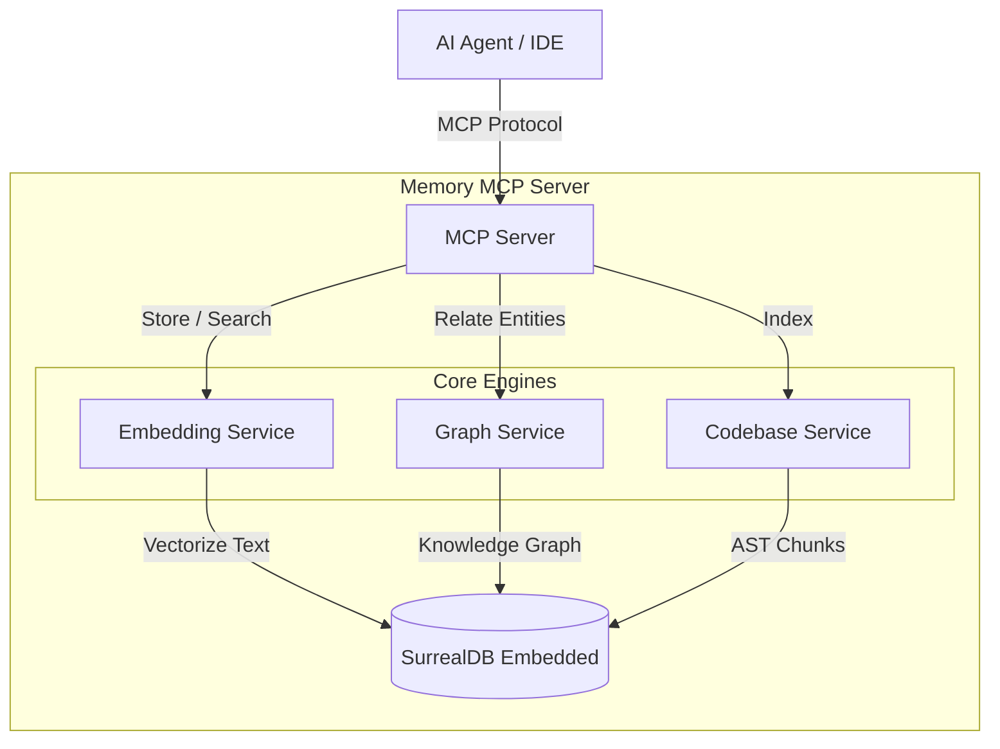

# 🧠 Memory MCP Server

[](https://github.com/pomazanbohdan/memory-mcp-1file/actions/workflows/release.yml)
[](https://github.com/pomazanbohdan/memory-mcp-1file/pkgs/container/memory-mcp-1file)
[](https://opensource.org/licenses/MIT)
[](https://www.rust-lang.org)
[](#)

A high-performance, **pure Rust** Model Context Protocol (MCP) server that provides persistent, semantic, and graph-based memory for AI agents.

Works perfectly with:
*   **Claude Desktop**
*   **Claude Code** (CLI)
*   **Gemini CLI**
*   **Cursor**
*   **OpenCode**
*   **Cline** / **Roo Code**
*   Any other MCP-compliant client.

### 🏆 The "All-in-One" Advantage

Unlike other memory solutions that require a complex stack (Python + Vector DB + Graph DB), this project is **a single, self-contained executable**.

*   ✅ **No External Database** (SurrealDB is embedded)
*   ✅ **No API Keys, No Cloud, No Python** — Everything runs **100% locally** via an embedded ONNX runtime. The embedding model is baked into the binary and runs on CPU. Nothing leaves your machine.
*   ✅ **Zero Setup** (Just run one Docker container or binary)

It combines:
1.  **Vector Search** (FastEmbed) for semantic similarity.
2.  **Knowledge Graph** (PetGraph) for entity relationships.
3.  **Code Indexing** with **symbol graph** (calls, extends, implements) for deep codebase understanding.
4.  **Hybrid Retrieval** (Reciprocal Rank Fusion) for best results.

### 🏗️ Architecture



> **[Click here for the Detailed Architecture Documentation](./ARCHITECTURE.md)**

---

## 🤖 Agent Integration (System Prompt)

Memory is useless if your agent doesn't check it. To get the "Long-Term Memory" effect, you must instruct your agent to follow a strict protocol.

We provide a battle-tested **[Memory Protocol (AGENTS.md)](./AGENTS.md)** that you can adapt.

### 🛡️ Core Workflows (Context Protection)

The protocol implements specific flows to handle **Context Window Compaction** and **Session Restarts**:

1.  **🚀 Session Startup**: The agent *must* search for `TASK: in_progress` immediately. This restores the full context of what was happening before the last session ended or the context was compacted.
2.  **⏳ Auto-Continue**: A safety mechanism where the agent presents the found task to the user and waits (or auto-continues), ensuring it doesn't hallucinate a new task.
3.  **🔄 Triple Sync**: Updates **Memory**, **Todo List**, and **Files** simultaneously. If one fails (e.g., context lost), the others serve as backups.
4.  **🧱 Prefix System**: All memories use prefixes (`TASK:`, `DECISION:`, `RESEARCH:`) so semantic search can precisely target the right type of information, reducing noise.

These workflows turn the agent from a "stateless chatbot" into a "stateful worker" that survives restarts and context clearing.

### Recommended System Prompt Snippet

Instead of scattering instructions across IDE-specific files (like `.cursorrules`), establish `AGENTS.md` as the **Single Source of Truth**.

Instruct your agent (in its base system prompt) to:
1.  **Read `AGENTS.md`** at the start of every session.
2.  **Follow the protocols** defined therein.

Here is a minimal reference prompt to bootstrap this behavior:

```markdown
# 🧠 Memory & Protocol
You have access to a persistent memory server and a protocol definition file.

1.  **Protocol Adherence**:
    - READ `AGENTS.md` immediately upon starting.
    - Strictly follow the "Session Startup" and "Sync" protocols defined there.

2.  **Context Restoration**:
    - Run `search_text("TASK: in_progress")` to restore context.
    - Do NOT ask the user "what should I do?" if a task is already in progress.
```

### Why this matters?
Without this protocol, the agent loses context after compaction or session restarts. With this protocol, it maintains the **full context of the current task**, ensuring no steps or details are lost, even when the chat history is cleared.

---

## 🔌 Client Configuration

### Universal Docker Configuration (Any IDE/CLI)

To use this MCP server with any client (**Claude Code**, **OpenCode**, **Cline**, etc.), use the following Docker command structure.

**Key Requirements:**
1.  **Memory Volume**: `-v mcp-data:/data` (Persists your graph, embeddings, **and cached model weights**)
2.  **Project Volume**: `-v $(pwd):/project:ro` (Allows the server to read and index your code)
3.  **Init Process**: `--init` (Ensures the server shuts down cleanly)

> [!TIP]
> **Model Caching**: The embedding model (~1 GB) is stored in `/data/models/`. Using a **named volume** (`mcp-data:/data`) ensures the model is downloaded only once. Without a named volume, Docker creates a new anonymous volume on each `docker run`, causing the model to re-download every time.

#### JSON Configuration (Claude Desktop, etc.)

Add this to your configuration file (e.g., `claude_desktop_config.json`):

```json
{
  "mcpServers": {
    "memory": {
      "command": "docker",
      "args": [
        "run",
        "--init",
        "-i",
        "--rm",
        "--memory=3g",
        "-v", "mcp-data:/data",
        "-v", "/absolute/path/to/your/project:/project:ro",
        "ghcr.io/pomazanbohdan/memory-mcp-1file:latest"
      ]
    }
  }
}
```

> **Note:** Replace `/absolute/path/to/your/project` with the actual path you want to index. In some environments (like Cursor or VSCode extensions), you might be able to use variables like `${workspaceFolder}`, but absolute paths are most reliable for Docker.

### Cursor (Specific Instructions)

1.  Go to **Cursor Settings** > **Features** > **MCP Servers**.
2.  Click **+ Add New MCP Server**.
3.  **Type**: `stdio`
4.  **Name**: `memory`
5.  **Command**:
    ```bash
    docker run --init -i --rm --memory=3g -v mcp-data:/data -v "/Users/yourname/projects/current:/project:ro" ghcr.io/pomazanbohdan/memory-mcp-1file:latest
    ```
    *(Remember to update the project path when switching workspaces if you need code indexing)*

### OpenCode / CLI

```bash
docker run --init -i --rm --memory=3g \
  -v mcp-data:/data \
  -v $(pwd):/project:ro \
  ghcr.io/pomazanbohdan/memory-mcp-1file:latest
```

### NPX / Bunx (No Docker required)

You can run the server directly via `npx` or `bunx`. The npm package automatically downloads the correct pre-compiled binary for your platform.

#### Claude Desktop

Add to `claude_desktop_config.json`:

```json
{
  "mcpServers": {
    "memory": {
      "command": "npx",
      "args": ["-y", "memory-mcp-1file"]
    }
  }
}
```

#### Claude Code (CLI)

```bash
claude mcp add memory -- npx -y memory-mcp-1file
```

#### Cursor

1.  Go to **Cursor Settings** > **Features** > **MCP Servers**.
2.  Click **+ Add New MCP Server**.
3.  **Type**: `command`
4.  **Name**: `memory`
5.  **Command**: `npx -y memory-mcp-1file`

Or add to `.cursor/mcp.json`:

```json
{
  "mcpServers": {
    "memory": {
      "command": "npx",
      "args": ["-y", "memory-mcp-1file"]
    }
  }
}
```

#### Windsurf / VS Code

Add to your MCP settings:

```json
{
  "mcpServers": {
    "memory": {
      "command": "npx",
      "args": ["-y", "memory-mcp-1file"]
    }
  }
}
```

#### Bun

```json
{
  "mcpServers": {
    "memory": {
      "command": "bunx",
      "args": ["memory-mcp-1file"]
    }
  }
}
```

> **Note:** Unlike Docker, `npx`/`bunx` runs the binary **locally** — it already has access to your filesystem, so no directory mounting is needed. To customize the data storage path, pass `--data-dir` via args:
> ```json
> "args": ["-y", "memory-mcp-1file", "--", "--data-dir", "/path/to/data"]
> ```

### Gemini CLI

Add to your `~/.gemini/settings.json`:

```json
{
  "mcpServers": {
    "memory": {
      "command": "npx",
      "args": ["-y", "memory-mcp-1file"]
    }
  }
}
```

Or with Docker:

```json
{
  "mcpServers": {
    "memory": {
      "command": "docker",
      "args": [
        "run", "--init", "-i", "--rm", "--memory=3g",
        "-v", "mcp-data:/data",
        "-v", "${workspaceFolder}:/project:ro",
        "ghcr.io/pomazanbohdan/memory-mcp-1file:latest"
      ]
    }
  }
}
```

---

## ✨ Key Features

- **Semantic Memory**: Stores text with vector embeddings (`e5-small` by default) for "vibe-based" retrieval.
- **Graph Memory**: Tracks entities (`User`, `Project`, `Tech`) and their relations (`uses`, `likes`). Supports PageRank-based traversal.
- **Code Intelligence**: Indexes local project directories (AST-based chunking) for Rust, Python, TypeScript, JavaScript, Go, Java, and **Dart/Flutter**. Tracks **calls, imports, extends, implements, and mixin** relationships between symbols.
- **Temporal Validity**: Memories can have `valid_from` and `valid_until` dates.
- **SurrealDB Backend**: Fast, embedded, single-file database.

---

## 🛠️ Tools Available

The server exposes **27 tools** to the AI model, organized into logical categories.

### 🧠 Core Memory Management
| Tool | Description |
|------|-------------|
| `store_memory` | Store a new memory with content and optional metadata. |
| `update_memory` | Update an existing memory (only provided fields). |
| `delete_memory` | Delete a memory by its ID. |
| `list_memories` | List memories with pagination (newest first). |
| `get_memory` | Get a specific memory by ID. |
| `invalidate` | Soft-delete a memory (mark as invalid). |
| `get_valid` | Get currently active memories (filters out expired ones). |
| `get_valid_at` | Get memories that were valid at a specific past timestamp. |

### 🔎 Search & Retrieval
| Tool | Description |
|------|-------------|
| `recall` | **Hybrid search** (Vector + Keyword + Graph). Best for general questions. |
| `search` | Pure semantic vector search. |
| `search_text` | Exact keyword match (BM25). |

### 🕸️ Knowledge Graph
| Tool | Description |
|------|-------------|
| `create_entity` | Define a node (e.g., "React", "Authentication"). |
| `create_relation` | Link nodes (e.g., "Project" -> "uses" -> "React"). |
| `get_related` | Find connected concepts via graph traversal. |
| `detect_communities` | Detect communities in the graph using Leiden algorithm. |

### 💻 Codebase Intelligence
| Tool | Description |
|------|-------------|
| `index_project` | Scan and index a local folder for code search. |
| `get_index_status` | Check if indexing is in progress or failed. |
| `list_projects` | List all indexed projects. |
| `delete_project` | Remove a project and its code chunks from the index. |
| `search_code` | Semantic search over code chunks. |
| `recall_code` | **Hybrid code search** (Vector + BM25 + Symbol Graph PageRank via RRF). Best quality code retrieval. |
| `search_symbols` | Search for functions/classes by name. |
| `get_callers` | Find functions that call a given symbol. |
| `get_callees` | Find functions called by a given symbol. |
| `get_related_symbols` | Get related symbols via graph traversal (calls, extends, implements). |

### ⚙️ System & Maintenance
| Tool | Description |
|------|-------------|
| `get_status` | Get server health and loading status. |
| `reset_all_memory` | **DANGER**: Wipes all data (memories, graph, code). |

---

## ⚙️ Configuration

Environment variables or CLI args:

| Arg | Env | Default | Description |
|-----|-----|---------|-------------|
| `--data-dir` | `DATA_DIR` | `./data` | DB location |
| `--model` | `EMBEDDING_MODEL` | `e5_multi` | Embedding model (`e5_small`, `e5_multi`, `nomic`, `bge_m3`) |
| `--log-level` | `LOG_LEVEL` | `info` | Verbosity |

### 🧠 Available Models

You can switch the embedding model using the `--model` arg or `EMBEDDING_MODEL` env var.

| Argument Value | HuggingFace Repo | Dimensions | Size | Use Case |
| :--- | :--- | :--- | :--- | :--- |
| `e5_small` | `intfloat/multilingual-e5-small` | 384 | 134 MB | Fastest, minimal RAM. Good for dev/testing. |
| `e5_multi` | `intfloat/multilingual-e5-base` | 768 | 1.1 GB | **Default**. Best balance of quality/speed. |
| `nomic` | `nomic-ai/nomic-embed-text-v1.5` | 768 | 1.9 GB | High quality long-context embeddings. |
| `bge_m3` | `BAAI/bge-m3` | 1024 | 2.3 GB | State-of-the-art multilingual quality. Heavy. |

> [!WARNING]
> **Changing Models & Data Compatibility**
>
> If you switch to a model with different dimensions (e.g., from `e5_small` to `e5_multi`), **your existing database will be incompatible**.
> You must delete the data directory (volume) and re-index your data.
>
> Switching between models with the same dimensions (e.g., `e5_multi` <-> `nomic`) is theoretically possible but not recommended as semantic spaces differ.

## 🔮 Future Roadmap (Research & Ideas)

Based on analysis of advanced memory systems like [Hindsight](https://hindsight.vectorize.io/) (see their documentation for details on these mechanisms), we are exploring these "Cognitive Architecture" features for future releases:

### 1. Meta-Cognitive Reflection (Consolidation)
*   **Problem:** Raw memories accumulate noise over time (e.g., 10 separate memories about fixing the same bug).
*   **Solution:** Implement a `reflect` background process (or tool) that periodicallly scans recent memories to:
    *   **De-duplicate** redundant entries.
    *   **Resolve conflicts** (if two memories contradict, keep the newer one or flag for review).
    *   **Synthesize** low-level facts into high-level "Insights" (e.g., "User prefers Rust over Python" derived from 5 code choices).

### 2. Temporal Decay & "Presence"
*   **Problem:** Old memories can sometimes drown out current context in semantic search.
*   **Solution:** Integrate **Time Decay** into the Reciprocal Rank Fusion (RRF) algorithm.
    *   Give a calculated boost to recent memories for queries implying "current state".
    *   Allow the agent to prioritize "working memory" over "historical archives" dynamically.

### 3. Namespaced Memory Banks
*   **Problem:** Running one docker container per project is resource-heavy.
*   **Solution:** Add support for `namespace` or `project_id` scoping.
    *   Allows a single server instance to host isolated "Memory Banks" for different projects or agent personas.
    *   Enables "Switching Context" without restarting the container.

### 4. Epistemic Confidence Scoring
*   **Problem:** The agent treats a guess the same as a verified fact.
*   **Solution:** Add a `confidence` score (0.0 - 1.0) to memory schemas.
    *   Allows storing hypotheses ("I think the bug is in auth.rs", confidence: 0.3).
    *   Retrieval tools can filter out low-confidence memories when answering factual questions.

---

## License

MIT
