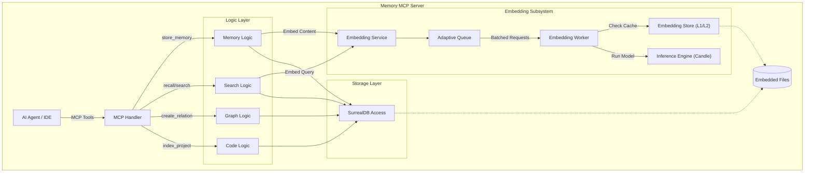
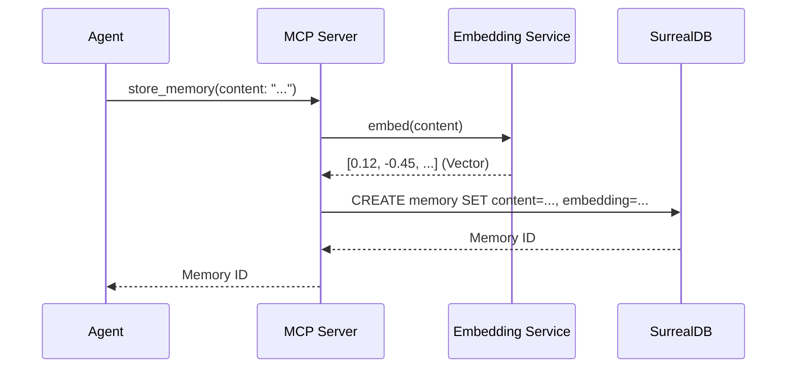
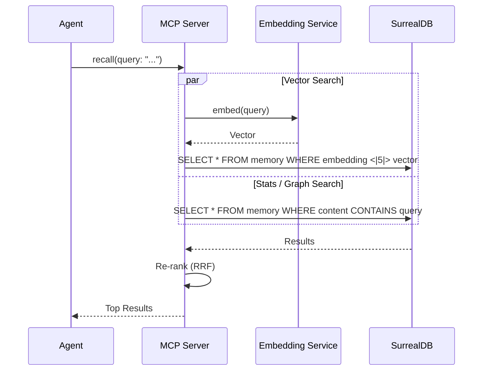

# Архітектура Memory MCP Server

## Огляд Високого Рівня
Memory MCP Server - це автономна система пам'яті для AI агентів, написана на Rust. Вона поєднує в собі семантичний пощук (вектори), граф знань та індексацію коду в одному бінарному файлі без зовнішніх залежностей.

### Ключові Компоненти
1. **MCP Server**: Обробляє запити від клієнтів (IDE, Агенти).
2. **Embedding Architecture**: Генерує вектори локально за допомогою `candle` / `ort`.
3. **Storage Layer**: Вбудована SurrealDB для зберігання векторів, графів та метаданих.
4. **Codebase Engine**: Індексує код з використанням Tree-sitter (в процесі розробки).

## Діаграма Компонентів (C4 Container)

## Деталізація Компонентів та Алгоритми

### 1. Logic Layer (Логічний Шар)
Відповідає за обробку запитів, маршрутизацію та реалізацію бізнес-логіки.

*   **Reciprocal Rank Fusion (RRF)**: Алгоритм об'єднання результатів пошуку з різних джерел (Vector Search, BM25, Knowledge Graph).
    *   *Навіщо*: Векторний пошук гарний для семантики ("сенс"), BM25 для точних співпадінь ключових слів, а Граф для зв'язків. RRF дозволяє взяти найкраще з усіх трьох світів без складного тюнінгу ваг.
    *   *Formula*: `score = 1.0 / (k + rank)`
*   **BM25**: Алгоритм текстового пошуку (Okapi BM25). Реалізований поверх індексів SurrealDB.

### 2. Embedding Subsystem (Підсистема Векторизації)
Критичний компонент для семантичного пошуку. Працює автономно.

*   **Adaptive Queue**: Розумна черга, що регулює швидкість обробки запитів на векторизацію (Backpressure).
    *   *Алгоритм*: Моніторить глибину черги та сповільнює нові запити (`THROTTLE_DELAY_MS`), якщо черга заповнена > 80% (`HIGH_WATERMARK`).
    *   *Навіщо*: Запобігає OOM (Out of Memory) при масовій індексації файлів.
*   **Inference Engine (Candle)**: Використовує бібліотеку `candle` (Hugginface) для запуску BERT-подібних моделей (nomic-embed, e5) на CPU. Не потребує Python.
*   **L1/L2 Cache**:
    *   L1: LRU Cache в RAM для найчастіших запитів.
    *   L2: Дисковий кеш (Sled/SurrealDB) для уникнення повторної векторизації незміненого контенту.

### 3. Graph Algorithms (Графові Алгоритми)
Використовуються для аналізу зв'язків між сутностями (файли, функції, нотатки).

*   **Personalized PageRank (PPR)**: Алгоритм ранжування вузлів графа відносно "стартових" точок (seed nodes).
    *   *Застосування*: Коли користувач шукає "Authorization", ми знаходимо вузол "Authorization", а PPR знаходить всі пов'язані концепції (наприклад, "Login", "JWT", "OAuth"), навіть якщо в тексті немає слова "Authorization".
    *   *Hub Dampening*: Модифікація для зменшення ваги "супер-вузлів" (які пов'язані з усім), щоб уникнути шуму.
*   **Leiden Algorithm**: Алгоритм виявлення спільнот (Community Detection).
    *   *Навіщо*: Групує тісно пов'язані файли або концепції в кластери. Допомагає зрозуміти модульну структуру проекту.

### 4. Codebase Engine (Рушій Кодової Бази)
Відповідає за розуміння коду.

*   **Tree-Sitter Chunking**: Розумне розбиття коду на фрагменти (чанки) на основі абстрактного синтаксичного дерева (AST), а не просто по рядках.
    *   *Логіка*: Враховує межі функцій та класів. Великі функції розбиваються на менші логічні блоки, зберігаючи контекст.
    *   *Навіщо*: Векторний пошук працює краще з логічно завершеними шматками коду, ніж з довільними нарізками тексту.
*   **Content Hashing (Blake3)**: Швидке хешування для дедуплікації. Якщо файл не змінився, він не переіндексується.

## Потік Даних: Збереження Пам'яті (Store Memory)

## Потік Даних: Пошук (Recall / Hybrid Search)

## Структура Модулів (Crate Structure)

* `src/main.rs`: Точка входу, ініціалізація CLI та сервісів.
* `src/server/`: Реалізація MCP протоколу та маршрутизація інструментів.
* `src/embedding/`: Обгортка над `candle` для локального інференсу моделей.
* `src/storage/`: Абстракція над SurrealDB.
* `src/graph/`: Алгоритми графів (PageRank, Community Detection).
* `src/codebase/`: Логіка індексації файлів та чанкування.
